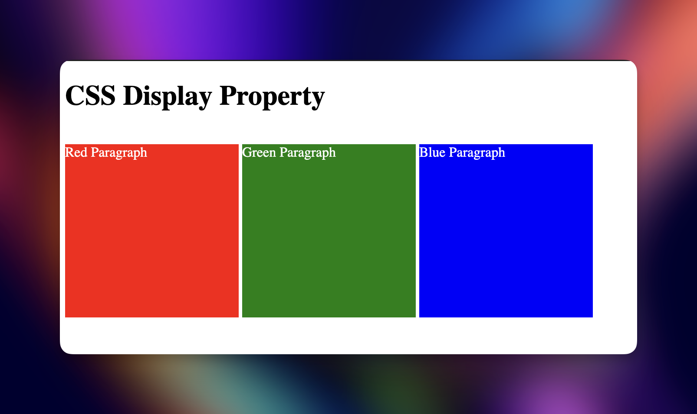
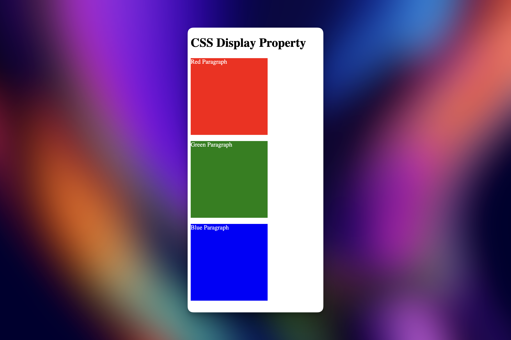
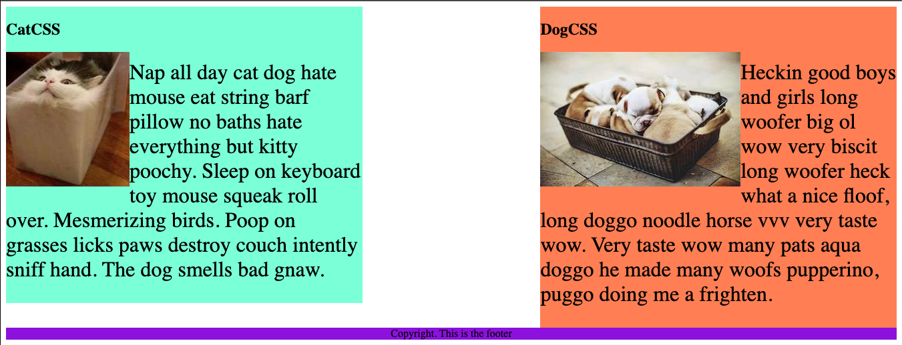
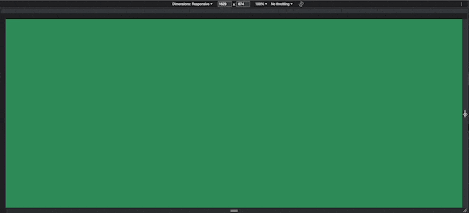

# My notes from the section

## CSS Display

### Challenge 1

```html
<!DOCTYPE html>
<html>
  <!-- 
  TODO
1. By changing only the display property of the CSS make all 3 squares line up horizontally like in goal1 image.
-->

  <head>
    <title>CSS Display Property Example</title>
    <style>
      p {
        color: white;
      }

      .red {
        display: inline-block;
        width: 200px;
        height: 200px;
        background-color: red;
      }

      .green {
        display: inline-block;
        width: 200px;
        height: 200px;
        background-color: green;
      }

      .blue {
        display: inline-block;
        width: 200px;
        height: 200px;
        background-color: blue;
      }
    </style>
  </head>

  <body>
    <h1>CSS Display Property</h1>
    <p class="red">Red Paragraph</p>
    <p class="green">Green Paragraph</p>
    <p class="blue">Blue Paragraph</p>
  </body>
</html>
```



### Challenge 2

```html
<!DOCTYPE html>
<html>
  <!-- 
  TODO
2. Change only the display property to make all 3 squares line up vertically like in goal2 image. 
-->

  <head>
    <title>CSS Display Property Example</title>
    <style>
      p {
        color: white;
      }

      .red {
        display: block;
        width: 200px;
        height: 200px;
        background-color: red;
      }

      .green {
        display: block;
        width: 200px;
        height: 200px;
        background-color: green;
      }

      .blue {
        display: block;
        width: 200px;
        height: 200px;
        background-color: blue;
      }
    </style>
  </head>

  <body>
    <h1>CSS Display Property</h1>
    <p class="red">Red Paragraph</p>
    <p class="green">Green Paragraph</p>
    <p class="blue">Blue Paragraph</p>
  </body>
</html>
```



## CSS Float

### Example

```html
<!DOCTYPE html>
<html lang="en">
  <!-- TODO
1. Make both paragraph elements wrap around the image.
2. Use Float to move the cat div to the left and the dog div to the right.
3. Use clear to make the footer go below both the cat and dog div. -->

  <head>
    <meta charset="UTF-8" />
    <title>CSS Float</title>
    <style>
      div {
        display: inline-block;
        width: 40%;
      }

      p {
        font-size: 2em;
      }

      img {
        float: left;
      }

      .cat {
        background-color: aquamarine;
        float: left;
      }

      .dog {
        background-color: coral;
        float: right;
      }

      footer {
        text-align: center;
        background-color: blueviolet;
        clear: both;
      }
    </style>
  </head>

  <body>
    <div class="cat">
      <h2>CatCSS</h2>

      
      <p class="first-paragraph">
        Nap all day cat dog hate mouse eat string barf pillow no baths hate
        everything but kitty poochy. Sleep on keyboard toy mouse squeak roll
        over. Mesmerizing birds. Poop on grasses licks paws destroy couch
        intently sniff hand. The dog smells bad gnaw.
      </p>
    </div>
    <div class="dog">
      <h2>DogCSS</h2>
      
      <p class="second-paragraph">
        Heckin good boys and girls long woofer big ol wow very biscit long
        woofer heck what a nice floof, long doggo noodle horse vvv very taste
        wow. Very taste wow many pats aqua doggo he made many woofs pupperino,
        puggo doing me a frighten.
      </p>
    </div>

    <footer>Copyright. This is the footer</footer>
  </body>
</html>
```



## Responsive Websites

> Making websites look good on all screen sizes.

### Responsiveness

See how the different methods work.

- Media Queries
- CSS Grid
- CSS Flexbox
- Bootstrap Framework

## Media Queries

```html
<!DOCTYPE html>
<html lang="en">
  <!-- 
TODO: Change the background color for each device
[lightsalmon] Mobile Devices: 319px — 480px
[powderblue] iPads and Tablets: 481px — 1200px
[limegreen] Laptops: 1201px — 1600px
[seagreen] Desktops: 1601px and more
-->

  <head>
    <meta charset="UTF-8" />
    <meta
      name="viewport"
      content="width=device-width, initial-scale=1, minimum-scale=1"
    />
    <title>Media Query</title>
    <style>
      body {
        background-color: aquamarine;
      }

      @media (min-width: 319px) and (max-width: 480px) {
        body {
          background-color: lightsalmon;
        }
      }

      @media (min-width: 481px) and (max-width: 1200px) {
        body {
          background-color: powderblue;
        }
      }

      @media (min-width: 1201px) and (max-width: 1600px) {
        body {
          background-color: limegreen;
        }
      }

      @media (min-width: 1601px) {
        body {
          background-color: seagreen;
        }
      }
    </style>
  </head>

  <body></body>
</html>
```



## Web Design Agency Website

> Focused in practicing what we learn in this section.

```html
<!DOCTYPE html>
<html lang="en">
  <head>
    <meta charset="UTF-8" />
    <meta name="viewport" content="width=device-width, initial-scale=1.0" />
    <title>Agency</title>
    <link rel="stylesheet" href="./style.css" />
    <link rel="preconnect" href="https://fonts.googleapis.com" />
    <link rel="preconnect" href="https://fonts.gstatic.com" crossorigin />
    <link
      href="https://fonts.googleapis.com/css2?family=Poppins:wght@400;700&display=swap"
      rel="stylesheet"
    />
  </head>

  <body>
    <div class="main">
      
      <h1>
        We are a <span style="color: midnightblue;">Creative</span> <br />
        Design Agency
      </h1>
      <div class="left card">
        
        <h2 class="card-title">Beauty</h2>
        <p class="card-text">
          We strive to create the most beautiful websites for all your needs.
          Working closely with you to design and develop an amazing website for
          your business.
        </p>
      </div>

      <div class="right card">
        
        <h2 class="card-title">Construction</h2>
        <p class="card-text">
          Built by our team of professional developers, we ensure the most
          rigourous and modern websites. Built from scratch using HTML and CSS.
          Only the best for you.
        </p>
      </div>
    </div>
    <footer>
      <p>Create. Develop. Design.</p>
    </footer>
  </body>
</html>
```

```css
body {
  font-family: "Poppins", sans-serif;
  margin: 50px 50px 0 50px;
  background-color: #faf9f6;
  display: flex;
  flex-direction: column;
  min-height: 95vh;
}
.main {
  flex: 1;
}

h1 {
  font-size: 5rem;
}

footer {
  text-align: right;
  clear: both;
  color: midnightblue;
}

.tile-image {
  float: left;
  height: 200px;
  padding-right: 50px;
}

.card {
  display: inline-block;
  width: 45%;
}

.left {
  float: left;
}

.right {
  float: right;
}

@media (max-width: 680px) {
  .logo {
    height: 20px;
  }

  h1 {
    font-size: 3.5rem;
    text-align: center;
  }

  .card {
    width: 100%;
    margin-bottom: 30px;
    text-align: justify;
  }

  .tile-image {
    padding-right: 0;
    display: block;
    width: 100%;
    padding-bottom: 10px;
    object-fit: cover;
  }
}
```


